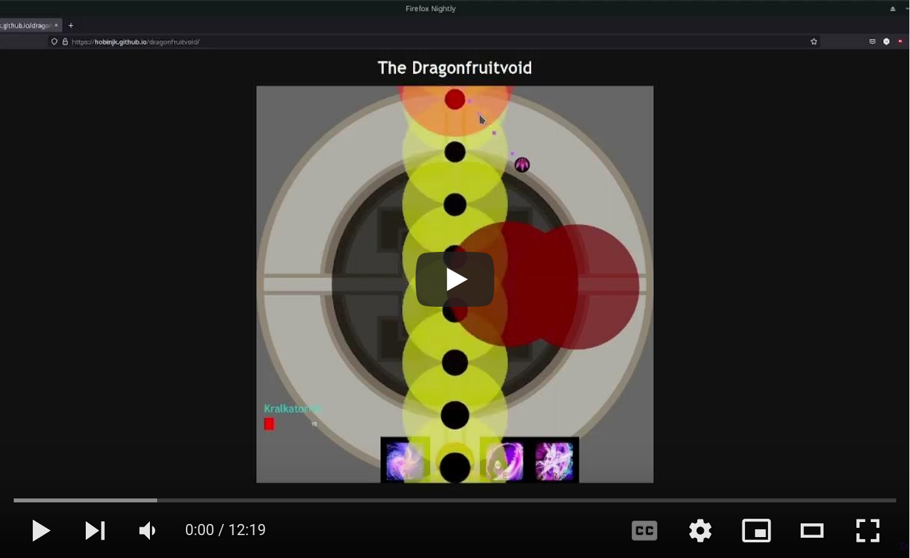

# The Dragonfruitvoid

[Play the Game](https://hobinjk.github.io/dragonfruitvoid/)

## Controls

- WASD - Move
- Mouse movement - Direction for all skills (including dodge)
- Left click - Shoot (hold down for best results)
- Space - Jump (short invulnerability to waves)
- V - Dodge
- E - Blink
- R - Portal (unimplemented)
- 4 - Pull

## Example

## Acknowledgements

Many thanks to every HT CM PoV I watched during this project, leobouilloux's
[HT CM markers](https://github.com/leobouilloux/GW2_HTCM_Markers) used for
green locations where possible, and Minas.4572 for [this outstanding
infographic](https://cdn.discordapp.com/attachments/1024098233921843241/1026976393810157659/unknown.png).

